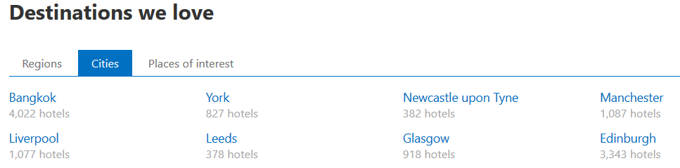
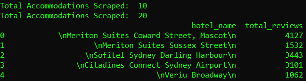

# BookingCom_Scraper
Web scraping hotel information from Booking.com with **BeautifulSoup4**. (In this case the hotel name and the total reviews number)

## Requirements
- Pandas
- Requests
- BeautifulSoup4

## Usage
1. Go to **[Booking.com](https://www.booking.com)**
2. Scroll down to this section:


3. Select a **City** and copy & paste the url into the .txt file
4. Run the Python script:
```python app.py```
5. Console output:

